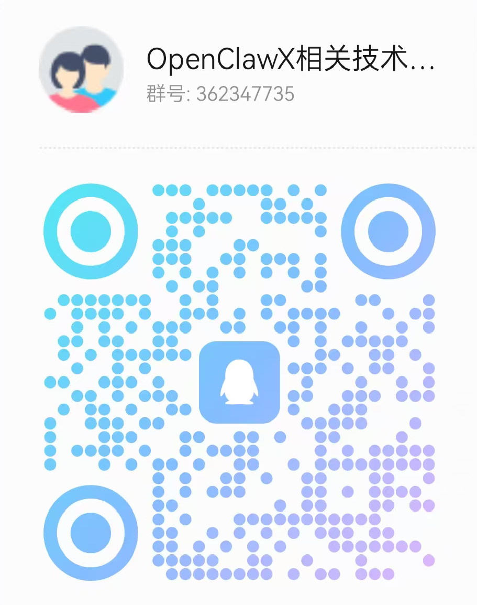

# OpenClawX

基于自已的OpenBot重构而来，你们的关注或***star***是我坚持的动力 ：）

[](https://nodejs.org/)
[](https://www.typescriptlang.org/)
[](https://opensource.org/licenses/MIT)

---

## 📚 文档导航 (Documentation)

**文档 (Documentation):** [中文 (Chinese)](docs/zh/README.md) · [English](docs/en/README.md)

完整使用说明请进入上述链接。中文文档结构如下：

| 分类 | 文档 | 说明 |
|------|------|------|
| **入门** | [快速开始](docs/zh/guides/getting-started.md) | 5 分钟跑通：安装、首次对话、桌面/通道入口 |
| | [安装与部署](docs/zh/guides/installation.md) | npm、Docker、Desktop 安装包及环境要求 |
| **使用指南** | [CLI 使用](docs/zh/guides/cli-usage.md) | 命令行对话、登录、模型与技能、开机自启 |
| | [桌面端使用](docs/zh/guides/desktop-usage.md) | Desktop 安装与启动、智能体/会话/技能/设置；对话内 `//` 指令查询与切换智能体 |
| | [Web 与 Gateway](docs/zh/guides/gateway-web.md) | 启动网关、端口与路径、Web 端连接 |
| | [使用场景](docs/zh/guides/usage-scenarios.md) | 整理下载目录、创建/切换智能体、B站下载助手、安装技能、MCP、定时任务等 |
| **配置** | [配置概览](docs/zh/configuration/config-overview.md) | 配置目录、config.json 与 agents.json |
| | [智能体配置](docs/zh/configuration/agents.md) | 本机/Coze/OpenClawX/OpenCode/Claude Code 执行方式与模型 |
| | [通道配置](docs/zh/configuration/channels.md) | 飞书、钉钉、Telegram、微信启用与配置项 |
| **功能说明** | [代理模式与多节点](docs/zh/features/proxy-mode.md) | Coze/OpenCode/Claude Code 接入、OpenClawX 多节点协作 |
| | [技能系统](docs/zh/features/skills.md) | Agent Skills 规范与扩展 |
| | [插件与扩展](docs/zh/features/plugins.md) | 扩展安装与编写、openbot extension 命令、用户手册 |
| **参考** | [常见问题](docs/zh/reference/faq.md) | 安装失败、端口占用、通道不回复等 FAQ |
| | [发布说明](docs/zh/release-notes.md) | 各版本功能更新与问题修复记录 |


### 常见问题（简要）

- **Windows 安装失败 / 无法运行？**  
  - **Desktop 安装包**：若安装或启动报错（如缺少运行库、闪退），请安装 [Visual C++ Redistributable](https://learn.microsoft.com/zh-cn/cpp/windows/latest-supported-vc-redist)（选 x64）；若为杀毒/安全软件拦截，可尝试加入排除项或暂时关闭后重试。  
  - **npm 全局安装**：Windows 上若因 `node-llama-cpp` 等原生依赖安装失败，可使用 `npm install -g @next-open-ai/openclawx --ignore-scripts` 跳过可选原生模块，对 CLI/Gateway/Desktop 常规使用无影响；长记忆需单独配置在线 RAG 或本地环境。  
- 更多问题（macOS 安装包「已损坏」、端口占用、通道不回复等）见 **[常见问题](docs/zh/reference/faq.md)**；版本变更见 **[发布说明](docs/zh/release-notes.md)**。

---

## 特性概览

| 能力 | 说明 |
|------|------|
| **技能架构** | 基于 Agent Skills 规范，支持多路径加载、本地安装与动态扩展；支持技能自我发现与自我迭代 |
| **编码智能体** | 集成 [pi-coding-agent](https://www.npmjs.com/package/@mariozechner/pi-coding-agent)，支持多轮工具调用与代码执行 |
| **浏览器自动化** | 内置 [agent-browser](https://www.npmjs.com/package/agent-browser)，可导航、填表、截图与数据抓取 |
| **长期记忆** | 向量存储（Vectra）+ 本地嵌入，支持经验总结与会话压缩（compaction） |
| **多端接入** | CLI、WebSocket 网关、Electron 桌面端，同一套 Agent 核心；各端技术栈见下方「各端技术栈」 |
| **多通道接入** | 飞书、钉钉、Telegram、微信等 IM 通道，Gateway 根据配置注册；入站经统一格式进 Agent，回复经通道回传 |
| **代理模式** | 智能体执行方式可选 **本机** / **Coze** / **OpenClawX** / **OpenCode** / **Claude Code**；本机使用当前模型与 Skills，**代理模式下本机 0 Token 消耗**，推理与消息处理在对方平台完成 |
| **Coze 接入** | 支持 Coze 国内站（api.coze.cn）与国际站（api.coze.com）；按站点分别配置 Bot ID 与 Access Token（PAT/OAuth/JWT），桌面端与通道均可选用 Coze 智能体；**0 Token 消耗**，适合 Coze 侧大量消息与长对话场景 |
| **OpenClawX 多节点协作** | 可将智能体代理到另一台 OpenClawX 实例（baseUrl + 可选 API Key），实现多节点分工、负载与协作；本机 0 Token 消耗 |
| **OpenCode 代理** | 可将智能体代理至 [OpenCode](https://opencode.ai/) 官方 Server（本地 `opencode serve` 或远程）；支持流式回复、斜杠指令 `/init`、`/undo`、`/redo`、`/share`、`/help`，与 TUI 使用方式一致；**0 Token 消耗**，适合 OpenCode 侧大量代码与长上下文能力 |
| **Claude Code 代理** | 可将智能体代理至本机 [Claude Code](https://github.com/anthropics/claude-code) CLI；需本机已安装 `claude` 命令（如 `npm install -g @anthropic-ai/claude-code`），可选配置工作目录（默认使用智能体工作区 `~/.openbot/workspace/<workspace>/`）；**0 Token 消耗**，推理由 Claude Code CLI 完成 |
| **MCP** | 已支持 [MCP](https://modelcontextprotocol.io/)（Model Context Protocol）：智能体可配置 stdio/SSE 两种连接方式，按智能体绑定 MCP 服务器，会话内自动加载对应工具，降低 Token 消耗与大模型幻觉 |
| **RPA（影刀）** | 通过 MCP 可接入影刀 RPA：在智能体 MCP 配置中添加 [yingdao-mcp-server](https://www.npmjs.com/package/yingdao-mcp-server)（命令 `npx -y yingdao-mcp-server`，可选 env 如 `RPA_MODEL`、`SHADOWBOT_PATH`、`USER_FOLDER`），即可在对话中调用影刀自动化能力 |
| **插件支持** | 通过 `openbot extension install/list/uninstall` 在 `~/.openbot/plugins` 安装 npm 包形式扩展；详见 [插件与扩展](docs/zh/features/plugins.md) |

---

## 技术架构

```
┌─────────────────────────────────────────────────────────────────────────────┐
│                              客户端 / 接入层                                  │
├─────────────────┬─────────────────────────────┬─────────────────────────────┤
│   CLI (openbot) │   WebSocket Gateway (JSON-RPC)  │   OpenBot Desktop (Electron)  │
│   Commander     │   ws, 端口 38080              │   Vue 3 + Pinia + Vite       │
└────────┬────────┴──────────────┬──────────────┴──────────────┬──────────────┘
         │                        │                             │
         │                        │  HTTP + Socket.io            │
         ▼                        ▼                             ▼
┌─────────────────────────────────────────────────────────────────────────────┐
│                            Gateway Server (Node)                             │
│  • 内嵌 Nest（/server-api）• 按 path 分流 • 静态资源 • 自动发现端口             │
└────────────────────────────────────┬────────────────────────────────────────┘
                                      │
         ┌────────────────────────────┼────────────────────────────┐
         ▼                            ▼                            ▼
┌─────────────────┐    ┌─────────────────────────────┐    ┌─────────────────────┐
│  Agent 核心      │    │  Desktop Backend (NestJS)   │    │  Memory / 向量存储   │
│  AgentManager   │    │  server-api/*               │    │  Vectra + 嵌入       │
│  执行方式:      │    │  Agents · Skills · Tasks    │    │  compaction 扩展     │
│  local/coze/    │    │  Auth · Users · Workspace   │    │  sql.js              │
│  openclawx/     │    │                             │    │                     │
│  opencode/      │    │                             │    │                     │
│  claude_code(代理)│   │                             │    │                     │
│  pi-coding-agent│    │                             │    │                     │
│  pi-ai 多模型   │    │                             │    │                     │
└────────┬────────┘    └─────────────────────────────┘    └─────────────────────┘
         │
         ▼
┌─────────────────────────────────────────────────────────────────────────────┐
│  Tools: read/write/edit · bash · find/grep/ls · browser · install-skill ·   │
│         save-experience (写入记忆) · Proxy(local/coze/openclawx/opencode/claude_code)   │
└─────────────────────────────────────────────────────────────────────────────┘
```

- **CLI**：直接调用 Agent 核心，单次提示或批量脚本；可启动 Gateway（`openbot gateway`）及配置开机自启（`openbot service install/uninstall`）。
- **WebSocket Gateway**（`src/gateway/`）：单进程内嵌 Nest，对外提供 WebSocket（JSON-RPC）与 HTTP；按 path 分流：`/server-api` 走 Nest、`/ws` 为 Agent 对话、`/ws/voice`/`/sse`/`/channel` 为扩展占位，其余为静态资源。根据配置注册**飞书、钉钉、Telegram、微信**等通道，入站消息经统一格式进入 Agent，回复经该通道发回对应平台。供 Web/移动端连接；支持以开机/登录自启方式常驻（Linux cron、macOS LaunchAgent、Windows 计划任务）。
- **Desktop 后端**（`src/server/`）：NestJS HTTP API，即 **server-api**；可被 Gateway 内嵌或独立监听（默认端口 38081）。会话、智能体配置、技能、任务、工作区、鉴权等由本模块提供。
- **Desktop**：Electron 包一层 Vue 前端 + 上述后端；通过 Gateway 或直连 Desktop 后端与 Agent 通信。
- **Agent 核心**：统一由 `AgentManager` 管理会话、技能注入与工具注册；**执行方式**可为 **local**（本机 pi-coding-agent + Skills）、**coze**（代理至 Coze 国内/国际站）、**openclawx**（代理至其他 OpenClawX 节点，多节点协作）、**opencode**（代理至 OpenCode 官方 Server，支持流式与 `/init`、`/undo`、`/redo`、`/share`、`/help` 等指令）、**claude_code**（代理至本机 Claude Code CLI，需已安装 `claude` 命令，可选工作目录）。记忆与 compaction 作为扩展参与 system prompt 与经验写入。

### 插件支持（Extensions）

扩展以 npm 包形式安装到 **`~/.openbot/plugins`**（可通过环境变量 `OPENBOT_PLUGINS_DIR` 覆盖）。使用 **`openbot extension install &lt;pkg&gt;`** 安装、**`openbot extension list`** 查看、**`openbot extension uninstall &lt;pkg&gt;`** 卸载。扩展包需**默认导出一个函数** `(pi) => void`（或 `() => (pi) => void`），在函数内通过 **`pi.registerTool`** 注册新工具，即可在会话中被模型调用。仓库内示例：`examples/plugins/openclawx-demo-extension`；完整说明与用户手册见 [插件与扩展](docs/zh/features/plugins.md)。

## 各端技术栈

| 端 | 技术 |
|------|------|
| **CLI** | Node.js 20+、TypeScript 5.7、Commander（gateway/login/config/service）；`openbot` 入口，配置 `~/.openbot/desktop`，支持开机自启 |
| **WebSocket Gateway** | JSON-RPC over WebSocket，默认 38080；单进程内嵌 Nest，path 分流（/server-api、/ws、/channel 等）；连接管理、通道（飞书/钉钉/Telegram/微信） |
| **Agent 核心** | pi-coding-agent、pi-ai 多模型；执行方式 local/coze/openclawx/opencode/claude_code；工具 read/write/bash/browser 等，SKILL.md 技能注入 |
| **Desktop 后端** | NestJS 10、Express、Socket.io，前缀 `server-api`；sql.js；Agents·Skills·Config·Auth·Workspace·Tasks |
| **Desktop 前端** | Electron 28、Vue 3、Pinia、Vite 5；Dashboard、Agents、Sessions、Skills、Settings、Tasks、Workspace |
| **记忆与向量** | Vectra 向量索引、远端嵌入、compaction 会话压缩、memory 目录持久化 |

---

# 一、安装与部署

安装与部署按**安装方式**划分：npm、Docker、Desktop 安装包。任选其一即可使用对应端的 CLI、Web 或 Desktop。

## 环境要求

- **Node.js** ≥ 20（npm 安装与本地开发必需）
- 可选：按所用 Provider 配置 API Key（如 `OPENAI_API_KEY`、`DEEPSEEK_API_KEY`）

---

## 1.1 npm 安装

适用于：使用 **CLI**，或在自有环境中运行 **Gateway（Web）**。

### 前置环境准备

需先安装 **Node.js 20+**（Node >=20）。任选一种方式安装即可：

| 方式 | 说明 |
|------|------|
| **官网安装包** | 打开 [nodejs.org](https://nodejs.org/)，下载 LTS 并安装；安装后终端执行 `node -v` 应显示 v20.x 或更高。 |
| **nvm（推荐）** | 多版本切换方便：`curl -o- https://raw.githubusercontent.com/nvm-sh/nvm/v0.40.1/install.sh \| bash`，重启终端后 `nvm install 20`、`nvm use 20`。 |
| **macOS (Homebrew)** | `brew install node@20`，或 `brew install nvm` 再用 nvm 安装 20。 |
| **Windows** | 使用 [nodejs.org](https://nodejs.org/) 安装包，或 `winget install OpenJS.NodeJS.LTS`。 |
| **Linux** | 使用发行版包管理器（如 `apt install nodejs`）或 [nvm](https://github.com/nvm-sh/nvm) 安装。 |

安装后请确认：

```bash
node -v   # 应为 v20.x 或 v22.x
npm -v    # 能正常输出版本号
```

### 安装命令

```bash
# 全局安装（测试过 node 版本：20/22；24 太新，部分库需本地编译环境）
npm install -g @next-open-ai/openclawx
```
#### ***如果是在windows上安装最新版本（v0.8.0以上版本），可能会因为node-llama-cpp无法安装，可以采用如下安装命令跳过它的安装，对当前系统使用无影响***
```bash
# 跳过预下载脚本
npm install -g @next-open-ai/openclawx --ignore-scripts
# 尝试手工安装跳过的预下载(这一步失败了也不影响正常使用)
npm run postinstall --if-present
```

安装后可直接使用 `openbot` 命令（见下方「使用方式」）。若需从源码构建再安装：

```bash
git clone <repo>
cd openclawx
npm install
npm run build
npm link   # 或 npm install -g . 本地全局安装
```

---

## 1.2 Docker 部署

适用于：在服务器或容器环境中运行 **Gateway**，供 Web/其他客户端连接。编排文件位于仓库 `deploy/` 目录。

### 方式一：使用 CI 构建的镜像（推荐生产）

镜像由 Drone CI（`.drone.yml`）构建并推送到镜像仓库。使用预构建镜像启动服务，暴露端口 **38080**：

```bash
# 在 deploy 目录下执行
cd deploy
docker compose up -d

# 或从仓库根目录指定 compose 文件
docker compose -f deploy/docker-compose.yaml up -d
```

默认使用镜像 `ccr.ccs.tencentyun.com/windwithlife/openclawx:latest`。若需指定版本，可修改 `deploy/docker-compose.yaml` 中 `image` 的 tag（如 `0.8.32`、`0.8.28`、`0.8.26` 或 CI 生成的 `build-ci-openbot-<BUILD_NUMBER>`）。

### 方式二：本地构建并运行（开发/无 CI 时）

不依赖镜像仓库，在本地从源码构建镜像并启动：

```bash
# 在仓库根目录执行（构建上下文为仓库根）
docker compose -f deploy/docker-compose-dev.yaml up --build -d

# 或在 deploy 目录下
cd deploy
docker compose -f docker-compose-dev.yaml up --build -d
```

构建完成后服务同样监听 **38080** 端口，镜像名为 `openclawx:dev`，容器名为 `openclawx-dev`。

**Docker 部署启动后，可通过 Web 方式配置与使用**：在浏览器中打开 **`http://localhost:38080`**（本机）或 **`http://宿主机IP:38080`**（局域网/远程），即可访问 server-api、健康检查及静态资源（若已挂载或内置前端），进行智能体、模型、通道等配置及对话，使用方式与 npm 启动网关一致（见下方「二、使用方式 → 2.2 Web」）。

### 配置与数据持久化

- Gateway 默认从容器内 `~/.openbot/desktop/` 读取配置（智能体、模型、通道等）。若需持久化或预置配置，可在 compose 中挂载宿主机目录，例如在 `deploy/docker-compose.yaml` 或 `deploy/docker-compose-dev.yaml` 的 `openclawx` 服务下增加：

  ```yaml
  volumes:
    - ./openbot-desktop:/root/.openbot/desktop
  ```

- API Key 等敏感信息也可通过环境变量传入（若 CLI/桌面端支持从环境变量读取），在 compose 的 `environment` 中配置即可。

---

## 1.3 Desktop 安装包

适用于：仅使用 **桌面端**，无需 Node 环境。

- 从 [Releases](https://github.com/next-open-ai/openclawx/releases) 下载对应平台的安装包（macOS / Windows）。
- 安装后启动 OpenClawX，按界面引导配置 API Key 与默认模型即可使用。

**macOS 若提示「已损坏、无法打开」**：因安装包未做 Apple 公证，从浏览器下载后会被系统加上「隔离」属性，出现“已损坏”的误报。请用**终端**去掉隔离属性后即可正常打开（一次性操作）：

1. 将下载的 `.dmg` 打开，把 `OpenBot.app` 拖到「应用程序」文件夹（或你想放的目录）。
2. 打开「终端」（应用程序 → 实用工具 → 终端），执行（路径按你实际放置位置修改）：
   ```bash
   xattr -c /Applications/OpenClawX.app
   find /Applications/OpenClawX.app -exec xattr -c {} \; 2>/dev/null
   ```
   若系统支持递归可简化为：`xattr -cr /Applications/OpenClawX.app`
3. 之后像普通应用一样打开 OpenClawX 即可，无需再右键或重复操作。

安装包由仓库通过 **Desktop 打包** 流程生成（见下方「三、开发 → 3.3 Desktop 开发 → Desktop 打包」）。

首次使用建议在设置中配置默认 Provider/模型，或通过 CLI 执行 `openbot login <provider> <apiKey> [model]` / `openbot config set-model <provider> <modelId>`（与桌面端共用 `~/.openbot/desktop/` 配置）。

---

# 二、使用方式

按**使用端**划分：CLI、Web、Desktop；另支持**飞书、钉钉、Telegram、微信**等通道（见 2.4）；后续将支持 iOS、Android 等。

## 2.1 CLI

在已通过 **npm 安装** 或 **源码构建并 link** 的环境中，在终端使用 `openbot`。

```bash
# 直接对话（使用默认 workspace 与技能）
openbot "总结一下当前有哪些技能"

# 指定技能路径
openbot -s ./skills "用 find-skills 搜一下 PDF 相关技能"

# 仅打印 system/user prompt，不调 LLM
openbot --dry-run --prompt "查北京天气"

# 指定模型与 provider（覆盖桌面缺省）
openbot --model deepseek-chat --provider deepseek "写一段 TypeScript 示例"
```

### CLI 配置（与桌面端共用）

CLI 与桌面端共用**桌面配置**（`~/.openbot/desktop/`）。主要文件：

- **config.json**：全局缺省 provider/model、**defaultModelItemCode**（缺省模型在 configuredModels 中的唯一标识）、缺省智能体 id（`defaultAgentId`）、各 provider 的 API Key/baseUrl、已配置模型列表（configuredModels）等。
- **agents.json**：智能体列表；每个智能体可配置 provider、model、**modelItemCode**（匹配 configuredModels）、工作区。**执行方式**可为 **local** / **coze** / **openclawx** / **opencode** / **claude_code**。Coze 代理：`runnerType: "coze"`，并配置 **region**（`cn` 国内 / `com` 国际）、**coze.cn** / **coze.com**（各含 botId、apiKey）。OpenClawX 代理：`runnerType: "openclawx"`，配置 **openclawx.baseUrl**、**openclawx.apiKey**（可选）。OpenCode 代理：`runnerType: "opencode"`，配置 **opencode**（mode、port、model、workingDirectory 等）。Claude Code 代理：`runnerType: "claude_code"`，可选 **claudeCode.workingDirectory**（默认使用工作区路径）。
- **provider-support.json**：Provider 与模型目录，供设置页下拉选择。

| 操作 | 命令 | 说明 |
|------|------|------|
| 保存 API Key（可选指定模型） | `openbot login <provider> <apiKey> [model]` | 写入 config.json；不传 model 时取该 provider 第一个模型并补齐缺省配置，可直接运行 |
| 设置缺省模型 | `openbot config set-model <provider> <modelId>` | 设置全局缺省 provider、model 及 defaultModelItemCode |
| 查看配置 | `openbot config list` | 列出 providers 与缺省模型 |
| 同步到 Agent 目录 | `openbot config sync` | 生成并写入 `~/.openbot/agent/models.json` |

**首次使用建议**：

```bash
# 方式一：login 后直接对话（不传 model 时自动用该 provider 第一个模型）
openbot login deepseek YOUR_DEEPSEEK_API_KEY
openbot "总结一下当前有哪些技能"

# 方式二：指定模型再 login
openbot login deepseek YOUR_DEEPSEEK_API_KEY deepseek-reasoner
openbot "总结一下当前有哪些技能"

# 方式三：先 login 再单独设置缺省模型
openbot login deepseek YOUR_DEEPSEEK_API_KEY
openbot config set-model deepseek deepseek-chat
openbot config sync
openbot "总结一下当前有哪些技能"
```

未在命令行指定 `--provider` / `--model` 时，CLI 使用缺省智能体对应的配置；单次可用 `--provider`、`--model`、`--api-key` 覆盖。未在配置中保存 API Key 时，会回退到环境变量（如 `OPENAI_API_KEY`、`DEEPSEEK_API_KEY`）。

---

## 2.2 Web

通过 **WebSocket 网关** 使用 OpenBot：先启动网关，再通过 Web 客户端连接。

**配置与访问地址**：可使用 **`http://localhost:38080`**（本机）或 **`http://你的IP:38080`**（局域网/远程）进行配置与使用；WebSocket 为 `ws://` 同 host/端口，HTTP 接口（如 `/server-api`、`/health`）与静态资源均通过上述地址访问。

### 通过 npm 启动网关

```bash
# 启动网关（默认端口 38080）
openclawx gateway --port 38080
```

若需网关开机/登录自启，可执行 `openbot service install`（支持 Linux / macOS / Windows）；移除自启用 `openbot service uninstall`，停止当前网关用 `openbot service stop`。

### 通过 Docker 启动后使用 Web 浏览器

若通过 **Docker** 方式启动（见上方「1.2 Docker 部署」），同样可通过 Web 浏览器进行配置与对话：在浏览器中打开 **`http://localhost:38080`** 或 **`http://宿主机IP:38080`**，即可进行智能体、模型、通道等配置及对话，使用方式与 npm 启动网关一致。WebSocket 客户端连接 `ws://localhost:38080` 或 `ws://宿主机IP:38080`，使用 JSON-RPC 调用 `connect`、`agent.chat`、`agent.cancel` 等。

客户端连接 `ws://localhost:38080`（或 `ws://你的IP:38080`），使用 JSON-RPC 调用 `connect`、`agent.chat`、`agent.cancel` 等（详见下方「Gateway API 简述」）。  
前端可自行实现或使用仓库内 Web 示例（若有）。

---

## 2.3 Desktop

- **通过安装包**：安装后直接打开 OpenBot Desktop，登录/配置后即可使用桌面界面（会话、智能体、技能、任务、工作区等）。
- **通过源码**：在「开发」章节中运行 `npm run desktop:dev` 启动开发版桌面。

桌面端与 CLI 共用同一套配置与 Agent 核心，同一台机器上配置一次即可双端使用。

---

## 2.4 通道支持

除 CLI、Web、Desktop 外，OpenClawX 支持通过**通道**将 Agent 对接到第三方 IM/协作平台。通道在 Gateway 启动时根据配置注册并运行：入站消息经统一格式进入 Agent，回复再经该通道发回平台。

### 已支持通道概览

| 通道 | 入站方式 | 出站/流式 | 会话 ID 格式 |
|------|----------|-----------|----------------|
| **飞书** | WebSocket 事件订阅（im.message.receive_v1） | 开放 API + 流式卡片更新 | `channel:feishu:<chat_id>` |
| **钉钉** | dingtalk-stream SDK（Stream 模式） | sessionWebhook POST | `channel:dingtalk:<conversationId>` |
| **Telegram** | 长轮询 getUpdates | sendMessage / editMessageText 流式更新 | `channel:telegram:<chat_id>` |
| **微信** | Wechaty（Web/UOS 协议）扫码登录 | say 一次性发送（不支持流式） | `channel:wechat:<thread_id>` |

### 飞书

**说明**：飞书通道通过飞书开放平台与机器人对接。入站使用飞书官方 **WebSocket 事件订阅**（`im.message.receive_v1`）接收用户消息；出站使用 **开放 API** 发送回复。支持**流式输出**：先发一条「思考中」的互动卡片，再随 Agent 生成内容逐次更新同一条卡片，直至整轮对话结束（`agent_end`）。

- **会话与 Agent**：同一飞书会话（单聊或群聊对应一个 `chat_id`）对应一个 Agent Session（`channel:feishu:<chat_id>`），由通道配置中的 `defaultAgentId` 指定使用哪个智能体。
- **能力**：单聊、群聊均可；支持文本消息与流式卡片展示；`turn_end` / `agent_end` 事件会向各端广播，便于前端或其它通道按需处理。

**配置**：enabled、appId、appSecret、defaultAgentId。**用法**：飞书开放平台创建自建应用、开通「机器人」与「接收消息」、事件订阅选 WebSocket；OpenClawX **设置 → 通道** 勾选「启用飞书」并填写 App ID、App Secret → 保存后**重启 Gateway**；在飞书内私聊或群聊 @ 机器人即可，回复以流式卡片更新。也可直接编辑 `~/.openbot/desktop/config.json` 中 `channels.feishu`。

### 钉钉

**说明**：钉钉通道使用 **dingtalk-stream** SDK 的 **Stream 模式**接收机器人消息，通过消息中的 `sessionWebhook` 回传回复；回复发送完成后需 ack 避免钉钉重试。支持单聊、群聊及流式回复。

- **会话与 Agent**：同一钉钉会话（conversationId）对应一个 Agent Session（`channel:dingtalk:<conversationId>`），由通道配置中的 `defaultAgentId` 指定智能体。

**配置**：enabled、clientId、clientSecret、defaultAgentId。**用法**：钉钉开发者后台创建企业内部应用、添加机器人能力并选择 **Stream 模式**；OpenClawX **设置 → 通道** 启用钉钉并填写 Client ID、Client Secret → 保存后**重启 Gateway**。在钉钉内与机器人对话即可。也可编辑 `config.json` 中 `channels.dingtalk`。

### Telegram

**说明**：Telegram 通道使用官方推荐的 **长轮询**（getUpdates）接收消息，无需公网 URL。出站使用 `sendMessage` 发送、`editMessageText` 流式更新同一条消息，直至整轮结束。

- **会话与 Agent**：同一 Telegram 会话（chat_id）对应一个 Agent Session（`channel:telegram:<chat_id>`），由通道配置中的 `defaultAgentId` 指定智能体。

**配置**：enabled、botToken、defaultAgentId。**用法**：通过 [@BotFather](https://t.me/BotFather) 获取 Bot Token；OpenClawX **设置 → 通道** 启用 Telegram 并填写 Bot Token → 保存后**重启 Gateway**。在 Telegram 内与机器人对话即可。也可编辑 `config.json` 中 `channels.telegram`。

### 微信

**说明**：微信通道基于 **Wechaty**（Web/UOS 协议），通过扫码登录个人微信账号接收与发送消息。不支持流式（微信无法编辑已发消息），回复在 agent_end 后一次性发送。支持单聊、群聊。

- **会话与 Agent**：同一微信会话（单聊为联系人 id、群聊为群 id）对应一个 Agent Session（`channel:wechat:<thread_id>`），由通道配置中的 `defaultAgentId` 指定智能体。
- **使用方式**：OpenClawX **设置 → 通道** 勾选「启用微信」，可选填写 **puppet**（如 `wechaty-puppet-wechat4u`，不填则使用 Wechaty 默认）；保存后**重启 Gateway**。启动后在设置页或通过 `/server-api/wechat/qrcode` 获取二维码，使用**微信扫码登录**。登录成功后即可在微信内与机器人对话。对话中同样支持 **`//` 指令** 查询与切换智能体。
- **账号说明**：微信对第三方协议有风控限制，**注册较早、使用时间较长的微信号** 相对更容易登录成功；新注册或存在风控的账号可能无法登录或易被限制，建议优先使用老号尝试。

**配置**：enabled、puppet、defaultAgentId。也可直接编辑 `~/.openbot/desktop/config.json` 中 `channels.wechat`。

未配置或未启用某通道时，Gateway 会跳过该通道启动；若已启用但必填项为空，控制台会提示到「设置 → 通道」检查。

### 2.4.1 代理模式与多节点协作

智能体除在本机运行（**local**）外，可配置为**代理模式**，将对话转发至 Coze、OpenCode、Claude Code 或另一台 OpenClawX，实现生态接入与多节点协作。**代理智能体为本机 0 Token 消耗模式**：推理与消息处理均在对方平台完成，本机仅做转发与展示，不占用本机模型 API 的 Token。特别适合 **Coze**、**OpenCode**、**Claude Code** 等具备大量消息、长上下文或代码协作能力的平台，在桌面端与通道中直接使用其能力而无需消耗本机配额。

| 模式 | 说明 | 配置要点 |
|------|------|----------|
| **local** | 本机执行，使用当前模型的 pi-coding-agent 与 Skills | 默认；无需额外配置 |
| **coze** | 代理至 Coze 平台 | 在桌面端「智能体 → 编辑 → 执行方式」选 Coze；**站点**选国内(cn)或国际(com)；分别填写该站点的 **Bot ID**、**Access Token**（PAT / OAuth 2.0 / JWT 等）。`agents.json` 中对应智能体为 `"runnerType": "coze"`，并含 `coze.region`、`coze.cn` / `coze.com`（botId、apiKey） |
| **openclawx** | 代理至其他 OpenClawX 实例（多节点） | 执行方式选 OpenClawX；填写目标实例 **baseUrl**（如 `http://另一台机器:38080`）、可选 **API Key**。`agents.json` 中为 `"runnerType": "openclawx"`，含 `openclawx.baseUrl`、`openclawx.apiKey`（可选） |
| **opencode** | 代理至 OpenCode 官方 Server | 执行方式选 OpenCode；本地模式需先在本机运行 `opencode serve`（默认 4096 端口），填写端口；远程模式填写地址与端口。可选密码、工作目录、默认模型。支持 `/init`、`/undo`、`/redo`、`/share`、`/help` 等斜杠指令，分享链接会回显到对话中 |
| **claude_code** | 代理至本机 Claude Code CLI | 执行方式选 Claude Code；需本机已安装 `claude` 命令（如 `npm install -g @anthropic-ai/claude-code` 并执行 `claude login`）。可选配置**工作目录**（默认使用智能体工作区 `~/.openbot/workspace/<workspace>/`）。`agents.json` 中为 `"runnerType": "claude_code"`，可选 `claudeCode.workingDirectory` |

- **入口**：桌面端「设置」→「智能体」中新建/编辑智能体时可选择执行方式；通道使用的默认智能体也可设为 Coze、OpenClawX、OpenCode 或 Claude Code 代理。
- **多节点**：多台机器各跑一个 OpenClawX Gateway，将部分智能体指向对方 baseUrl，即可实现分工、专机专用或负载均衡。

---

## 2.5 即将支持

**通道与终端**

| 端 | 说明 |
|----|------|
| **飞书** | 已支持，见上文「2.4 通道支持」。 |
| **钉钉** | 已支持，见上文「2.4 通道支持」。 |
| **Telegram** | 已支持，见上文「2.4 通道支持」。 |
| **微信** | 已支持，见上文「2.4 通道支持」（Wechaty 扫码登录；注册较早的微信号相对更易成功）。 |
| **iOS** | 规划中 |
| **Android** | 规划中 |

上述端将通过 WebSocket Gateway 或专用适配与现有 Agent 核心对接。

**生态与协议**

| 方向 | 说明 |
|------|------|
| **MCP** | **已支持**：智能体可配置 MCP 服务器（stdio 本地进程 / SSE 远程），会话内自动加载 MCP 工具；支持标准 JSON 配置格式（含服务器名称、command/args/env 或 url/headers），与 Skill 形成互补 |
| **RPA（影刀）** | **已支持**：通过 MCP 接入影刀 RPA（如 yingdao-mcp-server），在智能体配置中添加对应 MCP 即可在对话中调用影刀自动化 |
| **Coze 生态** | **已支持**：智能体执行方式可选 coze，按站点（国内 cn / 国际 com）配置 Bot ID 与 Access Token，桌面端与通道均可使用 |
| **OpenClawX 多节点** | **已支持**：执行方式可选 openclawx，通过 baseUrl（及可选 apiKey）将对话代理到另一 OpenClawX 实例，实现多节点协作与负载分工 |
| **OpenCode 代理** | **已支持**：执行方式可选 opencode，对接 OpenCode 官方 Server（本地 `opencode serve` 或远程）；流式回复、`/init`/`/undo`/`/redo`/`/share`/`/help` 等指令，分享链接回显；失败时展示「执行失败」提示 |
| **Claude Code 代理** | **已支持**：执行方式可选 claude_code，对接本机 Claude Code CLI（需已安装 `claude` 并登录）；可选工作目录，默认使用智能体工作区路径 |

文档与发布节奏后续更新。

---

# 三、开发

面向**参与 OpenBot 源码开发**的读者，按形态分为 CLI、Web（Gateway + 前端）、Desktop 三部分。

## 环境与依赖

- Node.js ≥ 20
- 仓库克隆后安装依赖并构建：

```bash
git clone <repo>
cd openclawx
npm install
npm run build
```

---

## 3.1 CLI 开发

- 入口：`openbot` → bin → `dist/cli/cli.js`
- 技术：Commander（子命令 `gateway`、`login`、`config`、`service`）、TypeScript 5.7
- 配置与数据：`~/.openbot/agent`、`~/.openbot/desktop`（与桌面共用）
- Gateway 开机自启：`openbot service install` / `uninstall` / `stop`（见 `src/cli/service.ts`）

修改 CLI 后重新构建并本地安装：

```bash
npm run build
npm link
openbot --help
```

---

## 3.2 Web 开发（Gateway + 前端）

- **Gateway**：`src/gateway/`，默认端口 38080，可 `-p` 指定；单进程内嵌 Nest，按 path 分流（`/server-api`、`/ws`、静态资源等）；协议 JSON-RPC over WebSocket；职责包括连接管理、消息路由、鉴权、静态资源。
- **方法**：`connect`、`agent.chat`、`agent.cancel`、`subscribe_session`、`unsubscribe_session` 等。

本地启动网关：

```bash
npm run build
openbot gateway --port 38080
```

若仓库内有独立 Web 前端工程，则分别启动 Gateway 与前端 dev server，前端通过 `ws://localhost:38080` 连接。

---

## 3.3 Desktop 开发

- **后端**：NestJS（`src/server/`），前缀 `server-api`，默认端口 38081；Gateway 内嵌时直接挂载该 Express，无独立子进程。
- **前端**：Electron 28 + Vue 3 + Pinia + Vite 5，位于 `apps/desktop/`。

```bash
# 先构建核心（若未构建）
npm run build

# 开发模式（Vite 热更 + Electron）
npm run desktop:dev

# 仅安装桌面依赖
npm run desktop:install
```

### Desktop 打包

从源码构建可安装的桌面安装包（DMG/NSIS/AppImage），供发布或本地安装使用。

**命令（在仓库根目录执行）：**

```bash
npm run desktop:pack
```

该命令会依次执行：

1. **根目录构建**：`npm run build`，生成 `dist/`（含 Gateway、Server、Agent 等）。
2. **桌面构建**：`cd apps/desktop && npm run build`，其中包含：
   - **build:gateway**：若需则再次构建根目录 `dist`；
   - **build:copy-gateway**：将根目录 `dist` 复制到 `apps/desktop/gateway-dist`，写入 `package.json`（`type: "module"` + 生产依赖），并执行 `npm install --production`，得到带 `node_modules` 的 gateway 运行时；
   - **build:renderer**：Vite 构建前端到 `renderer/dist`；
   - **electron-builder**：打包为各平台安装包，并将 `gateway-dist` 作为 **extraResources** 拷贝到应用内 `Contents/Resources/dist`（含 Gateway 代码与依赖），无需用户安装 Node 即可运行。

**产出物：**

- **macOS**：`apps/desktop/dist/` 下生成 `.dmg`、`.zip`（如 `OpenBot Desktop-0.1.1-arm64.dmg`）；
- **Windows**：nsis 安装程序；
- **Linux**：AppImage。

安装包安装后，Gateway 与前端均内嵌在应用内，用户无需单独安装 Node.js。

---

## 测试

```bash
# 单元/集成测试（含 config、gateway、server e2e）
npm test

# 仅 e2e
npm run test:e2e

# 记忆相关测试
npm run test:memory
```

测试分布：`test/config/` 桌面配置、`test/gateway/` 网关、`test/server/` Nest 后端 e2e。

---

# 附录

## Gateway API 简述

- **请求**：`{ "type": "request", "id": "<id>", "method": "<method>", "params": { ... } }`
- **成功响应**：`{ "type": "response", "id": "<id>", "result": { ... } }`
- **错误响应**：`{ "type": "response", "id": "<id>", "error": { "message": "..." } }`
- **服务端事件**：如 `agent.chunk`（流式输出）、`agent.tool`（工具调用）等，格式为 `{ "type": "event", "event": "...", "payload": { ... } }`

常用流程：先 `connect` 建立会话，再通过 `agent.chat` 发送消息并接收流式/事件；`agent.cancel` 取消当前任务。

---


---

### 社区与交流

扫码加入交流群：



---

## 许可证

MIT
